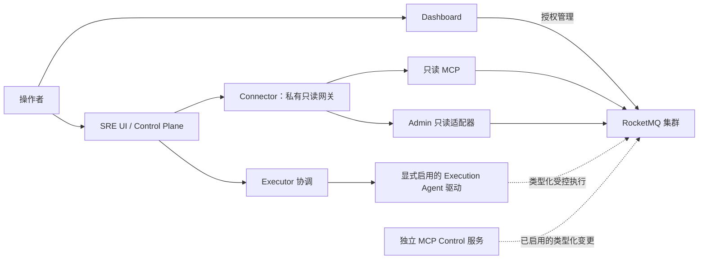

生态产品围绕核心消息服务，增加面向人的管理、只读诊断和独立受控自动化。应按产品持有的工作选择，再遵循其独立构建、配置与身份边界。

## 产品选择

| 产品 | 角色 | 部署边界 | 起点 |
| --- | --- | --- | --- |
| Web Dashboard | 浏览器集群/资源管理 | Rust HTTP 后端、React 前端及所选持久存储 | [Web 指南](./dashboards.md) |
| GPUI Dashboard | 原生桌面管理 | 独立 Rust 桌面包 | [GPUI 工程](./dashboards.md) |
| Tauri Dashboard | 使用 Web UI 的桌面应用 | Node 前端、Rust 后端和操作系统打包 | [Dashboard 构建指南](./dashboards.md) |
| MCP | 有界只读集群诊断及可选非变更计划 | 使用 stdio 或已配置 Streamable HTTP 的独立服务 | [MCP 指南](./mcp.md) |
| MCP Control | 类型化、受监督的集群变更 | 独立 TLS/OAuth 服务、feature 与策略启用 | [Control 指南](https://github.com/mxsm/rocketmq-rust/blob/main/rocketmq-ai/rocketmq-mcp-control/README.md) |
| AI SRE | 证据、诊断、事件、计划与执行协调 | 独立 SRE workspace、服务、UI 和存储 | [SRE 指南](https://github.com/mxsm/rocketmq-rust/blob/main/rocketmq-ai/rocketmq-sre/README.md) |

`rocketmq-dashboard-common` 是根 workspace 中的共享库，不能替代 Dashboard 应用的后端或 UI。SRE UI 与普通 Dashboard 是独立产品，不共享会话或原始变更接口。

## 读写路径保持分离

只读网关应用 SRE 产品的租户/集群、预算、截止时间、脱敏和审计策略。模型建议不会授权图中的虚线变更路径。SRE Executor 没有目标凭证或目标网络访问，实际目标交互由已注册 Execution Agent 驱动持有。

MCP Control 默认构建不包含生产变更工具。编译 `write-tools` 后，运行启用与操作允许列表仍决定注册范围。其已审定接口限定为指定类型化操作，不是任意 Admin 命令或 shell 接口。

## 按有效顺序搭建

1. 启动核心集群，通过[快速开始](../getting-started/quick-start.md)验证普通消息链路。
2. 配置所选运维产品需要的访问身份和网络可达性。
3. 从产品自己的工程根目录构建，并准备持久状态。
4. 先接入只读资产/诊断，并确认目标集群身份。
5. 通过该产品实际策略和凭证路径，仅启用部署需要的管理或执行能力。
6. 同时为产品自身及目标集群配置可观测性、保留策略、关闭和恢复。

运维 UI 可以访问，不代表能够通过目标集群认证。同样，核心消息存储和运维产品数据库是不同状态存储，具有不同备份与扩展要求。

## Dashboard 专用注意点

Web Dashboard 使用 Rust 2024/Axum 后端和 React/TypeScript/Vite 前端。后端属于独立工程，并包含多个二进制，启动 HTTP 服务时应选择 `rocketmq-dashboard-web-backend`。

配置存储可以是 File、SQLite、MySQL 或 PostgreSQL。启动时严格选择一个后端，不会静默回退到 File。File/SQLite 部署具有单节点约束，与使用外部 SQL 服务的部署不同。就绪包含所选存储的就绪情况，进程存活是另一项观察。

Tauri 中，`npm run build` 构建前端资产；`npm run tauri build` 结合 Rust 部分与平台工具打包桌面应用。GPUI 使用自己的独立 Cargo 工程及平台前置条件，这些检查不能互换。

## MCP 与 SRE 专用注意点

MCP stdio 模式的 stdout 保留给协议帧。Streamable HTTP 使用独立认证配置，传入 bearer token 不会作为集群凭证转发给 RocketMQ。可选变更计划只返回非变更建议。

SRE 是包含十一 crate 的独立 Rust 2024 workspace，另有 UI 和只读 Rust/TypeScript 客户端接口。PostgreSQL 是持久系统记录源，大型证据载荷使用私有对象存储。模型网关、证据保留和执行代理需要显式配置。

当前 Execution Agent 的操作开关默认关闭，仅注册配置完整的驱动。宽泛的产品能力表或已编译类型，不代表运行部署中全部操作都已启用，应查看所选服务配置和能力响应。

MCP Control 与 SRE 执行属于独立变更路径。安装其中之一，不会自动将只读 MCP 或 SDK 变为写接口。

## 分别观察产品与集群健康

分别跟踪目标集群可用性、产品数据库可用性、凭证有效性、证据新鲜度、模型可用性和执行驱动就绪。过时或部分观察必须保留相应标记，不能静默变成当前健康结果。

系统背景见[架构总览](../architecture/overview.md)、[模块地图](../architecture/module-map.md)和[部署总览](../deployment/overview.md)。上表链接的产品指南分别负责完整安装与运维流程。

## 产品详细指南

- [Web Dashboard](./dashboard-web.md)
- [桌面 Dashboard](./dashboard-desktop.md)
- [MCP Control](./mcp-control.md)
- [AI SRE 架构](./ai-sre.md)
- [AI SRE 部署](./ai-sre-deployment.md)
