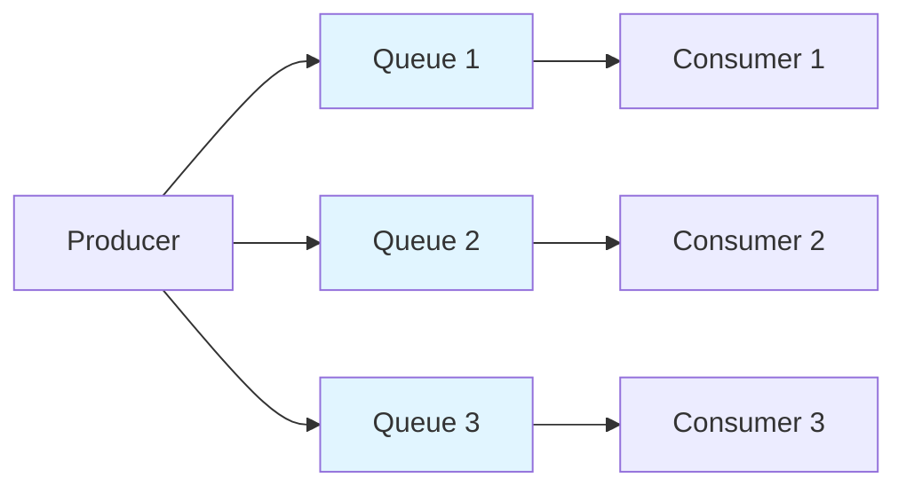

# 基本概念

理解 RocketMQ-Rust 的核心概念，是构建高效消息应用的基础。

## 核心组件

### 消息（Message）

消息是 RocketMQ 中最基础的通信单元。每条消息通常包含：

- **Topic**：消息所属的主题类别
- **Body**：实际消息体数据（字节数组）
- **Tags**：可选标签，用于在同一主题内做消息过滤
- **Keys**：可选消息键，用于索引与查询
- **Properties**：额外的键值元数据

```rust
use rocketmq::model::Message;

let message = Message::new("TopicTest".to_string(), b"Hello".to_vec());
message.set_tags("tag1");
message.set_keys("key1");
```

### 主题（Topic）

Topic 是消息的逻辑分组。生产者向 Topic 发送消息，消费者订阅 Topic 消费消息。

Topics 会被划分为多个队列，以支持并行处理和负载分摊。

```text
Topic: OrderEvents
├── Queue 0
├── Queue 1
├── Queue 2
└── Queue 3
```

### 生产者（Producer）

生产者是向 RocketMQ Broker 发送消息的应用端。

**关键特性：**

- 异步发送
- 事务消息
- 失败重试机制
- 跨 Broker 负载均衡

```rust
use rocketmq::producer::Producer;

let producer = Producer::new(producer_option);
producer.start().await?;
producer.send(message).await?;
```

### 消费者（Consumer）

消费者负责从 RocketMQ Broker 接收并处理消息。

**消费者类型：**

- **Push Consumer**：消息由 Broker 主动推送到消费者
- **Pull Consumer**：消费者主动从 Broker 拉取消息

```rust
use rocketmq::consumer::PushConsumer;

let consumer = PushConsumer::new(consumer_option);
consumer.subscribe("TopicTest", "*").await?;
consumer.start().await?;
```

### Broker

Broker 是 RocketMQ 的服务端，负责消息存储与投递，主要能力包括：

- 消息存储与持久化
- 消息查询
- 消费位点（offset）管理
- 通过复制提供高可用

### Name Server

Name Server 是轻量级路由服务，主要提供：

- Broker 路由信息
- Topic 到 Broker 的映射
- 心跳管理

Broker 启动后会向 Name Server 注册，客户端通过 Name Server 发现可用 Broker 地址。

## 消息模型

### 集群模式（默认）

在集群模式下，同一消费组内的消息会被分配给不同消费者，每条消息只会被其中一个消费者处理。

```text
Consumer Group: OrderProcessors
├── Consumer A → Queue 0, Queue 1
├── Consumer B → Queue 2, Queue 3
└── Consumer C → Queue 4, Queue 5

Message M1 (Queue 0) → Consumer A only
Message M2 (Queue 2) → Consumer B only
```

### 广播模式

在广播模式下，同一 Topic 的每条消息都会被消费组内所有消费者接收。

```text
Consumer Group: LogAggregators
├── Consumer A → All messages
├── Consumer B → All messages
└── Consumer C → All messages

Message M1 → Consumer A, B, and C
```

## 消息投递语义

### 至少一次（默认）

RocketMQ 默认保证每条消息至少投递一次，这意味着：

- 消息不会丢失
- 可能出现重复消息
- 消费端应实现幂等处理

### 有序性保证

**队列内有序**：同一队列中的消息按 FIFO 顺序消费。

**队列间无序**：同一 Topic 的不同队列之间不保证全局顺序。

如需严格顺序，请使用单队列，或通过消息队列选择器固定路由。



## 消费组（Consumer Group）

消费组是多个消费者的逻辑集合，它们协同消费同一 Topic 的消息。

**关键属性：**

- 组内消费者共享同一个 group name
- 在集群模式下，每条消息只会被组内一个消费者处理
- 组内自动进行负载均衡
- 每个消费组维护独立的消费位点

```rust
consumer_option.set_group_name("my_consumer_group");
```

## 下一步

掌握基本概念后，你可以继续阅读：

- [架构概览](../category/architecture) - 深入理解 RocketMQ 架构
- [生产者指南](../category/producer) - 学习生产者高级特性
- [消费者指南](../category/consumer) - 学习消费者高级特性
