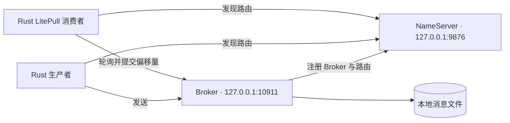

本教程在同一台机器上启动一个 Rust NameServer 和一个 Rust Broker，使用本地文件存储、显式资源创建以及仅监听回环地址的配置。先完成[安装](installation.md)，并将每个终端的工作目录保持在仓库根目录。

## 拓扑与地址



NameServer 提供地址，不转发消息体。两个客户端都必须能够访问路由查询返回的 Broker 地址。本教程使用回环地址，因此客户端需要在同一台机器上运行，且不能位于独立的容器网络命名空间。

| 端口 | 用途 | 配置 |
| --- | --- | --- |
| 9876 | NameServer remoting | `namesrv.toml` 的 `listenPort` |
| 10911 | Broker remoting | `broker.listenPort` |
| 10909 | Broker fast remoting | 由 Broker 端口减二得到 |
| 10912 | Broker HA 监听 | `store.haListenPort` |

确保这些端口可用。单 Broker 不构成故障转移拓扑，仅开启 HA 监听不会自动产生副本。

## 配置与数据目录

使用仓库中的 [namesrv.toml](https://github.com/mxsm/rocketmq-rust/blob/main/rocketmq-website/examples/first-message/namesrv.toml) 和 [broker.toml](https://github.com/mxsm/rocketmq-rust/blob/main/rocketmq-website/examples/first-message/broker.toml)。其中的路径相对于工作目录解析：

```text
.rocketmq-doc-demo/
  namesrv/       NameServer KV/config files
  broker/        Broker metadata and default log location
  store/         Message-store files
```

其中 `namesrv/` 保存 NameServer KV 与配置文件，`broker/` 保存 Broker 元数据及默认日志，`store/` 保存消息存储文件。启动前创建目录。PowerShell：

```powershell
New-Item -ItemType Directory -Force .rocketmq-doc-demo/namesrv, .rocketmq-doc-demo/broker, .rocketmq-doc-demo/store
```

Unix shell：

```bash
mkdir -p .rocketmq-doc-demo/namesrv .rocketmq-doc-demo/broker .rocketmq-doc-demo/store
```

Broker 配置采用规范的 `[broker]` 与 `[store]` 分节。集群名为 `DocsCluster`，Broker 名为 `docs-broker`，ID 为 `0`，角色为 `ASYNC_MASTER`，存储类型为 `LocalFile`。主题和消费者组的自动创建均已关闭，[快速开始](quick-start.md)将显式展示管理操作。

`brokerIp1` 是向客户端公布的地址，`broker.brokerServerConfig.bindAddress` 控制监听地址。只修改监听地址，不能修复不可达的公布地址。以 `broker.listenPort` 为端口配置入口，嵌套的 server 端口由它派生。Broker 元数据与消息存储分别使用两个分节中的 `storePathRootDir`。

## 终端 1：启动 NameServer

在每个服务终端中设置开发 profile。PowerShell：

```powershell
$env:ROCKETMQ_HOME = "$PWD"
$env:ROCKETMQ_SECURITY_PROFILE = "development-insecure-loopback"
cargo run -p rocketmq-namesrv --bin rocketmq-namesrv-rust -- -c rocketmq-website/examples/first-message/namesrv.toml
```

Unix shell：

```bash
export ROCKETMQ_HOME="$PWD"
export ROCKETMQ_SECURITY_PROFILE=development-insecure-loopback
cargo run -p rocketmq-namesrv --bin rocketmq-namesrv-rust -- -c rocketmq-website/examples/first-message/namesrv.toml
```

保持进程运行，先检查启动输出是否存在监听或配置错误，再继续操作。该 profile 明确允许不安全的本地开发，并要求监听回环地址，不能用于向共享网络或公网开放服务。

## 终端 2：启动 Broker

PowerShell：

```powershell
$env:ROCKETMQ_HOME = "$PWD"
$env:ROCKETMQ_SECURITY_PROFILE = "development-insecure-loopback"
cargo run -p rocketmq-broker --bin rocketmq-broker-rust -- -c rocketmq-website/examples/first-message/broker.toml -n 127.0.0.1:9876
```

Unix shell：

```bash
export ROCKETMQ_HOME="$PWD"
export ROCKETMQ_SECURITY_PROFILE=development-insecure-loopback
cargo run -p rocketmq-broker --bin rocketmq-broker-rust -- -c rocketmq-website/examples/first-message/broker.toml -n 127.0.0.1:9876
```

显式指定 `-n`，可以在环境变量存在其他地址时仍选择本教程的 NameServer。Broker 正常启动需要可用的 NameServer 注册路径。`-p` 打印配置可以辅助检查解析结果，但不会启动监听器，也不能验证完整运行链路。

## 终端 3：确认注册

运行管理命令前，在当前终端中设置 NameServer。PowerShell：

```powershell
$env:NAMESRV_ADDR = "127.0.0.1:9876"
```

Unix shell：

```bash
export NAMESRV_ADDR=127.0.0.1:9876
```

当前 `clusterList` 和 `updateSubGroup` 子命令使用环境变量，不接受 `-n`。下面的主题和进度查询命令各自支持 `-n`，它不是 CLI 全局参数。

执行以下只读查询：

```bash
cargo run -p rocketmq-admin-cli -- cluster clusterList
```

在结果中查找 `DocsCluster`、`docs-broker`、Broker ID `0` 和 `127.0.0.1:10911`。进程虽然运行，但缺少该注册记录时，仍不满足教程条件。此时先检查 Broker 注册错误和 NameServer 监听状态，再创建资源。

继续[快速开始](quick-start.md)。运行生产者与消费者期间，保持两个服务运行。

## 停止与重启

先停止客户端应用。在 Broker 终端按 **Ctrl+C** 并等待关闭完成，再以相同方式停止 NameServer。重启时复用同一配置和数据目录，不要让两个 Broker 同时打开同一个存储目录。

重启会保留适用的元数据和已存储的消费进度，不会自动创建空白演示环境。删除目录不是正常关闭或排障步骤。使用教程专用主题和消费者组，将练习与应用资源区分开。

来源：[NameServer 搭建](https://github.com/mxsm/rocketmq-rust/blob/main/rocketmq-namesrv/README.md)、[Broker 配置与生命周期](https://github.com/mxsm/rocketmq-rust/blob/main/rocketmq-broker/README.md)。
