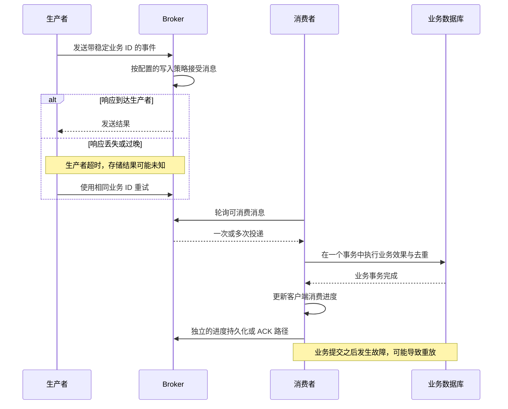

可靠消息处理需要明确两个问题：操作返回时，哪些工作已经完成；返回结果丢失时，可能发生什么。答案取决于发送路径、存储策略、消费模型和业务事务。

## 区分完成边界

| 边界 | 已发生的事情 | 仍然独立的部分 |
| --- | --- | --- |
| 已接受 | 所选 Broker 写入路径接受了消息 | 要求的磁盘/副本等待与可见性 |
| 按策略持久化 | 相应持久化/复制条件已完成 | 超出该策略的更强故障模型 |
| 可见 | 所选读取路径能够发现消息 | 投递给所有消费者 |
| 已投递 | 客户端取得了消息 | 业务副作用 |
| 已处理 | 应用完成了业务工作 | 消费进度持久化 |
| 进度已记录 | 所选进度/ACK 路径已推进 | 与外部数据库之间的原子事务 |

消息主日志及其派生结构承担不同职责。建立 ConsumeQueue、索引或定时视图，不能增强之前的写入确认。副本连接健康，也不同于等待副本进度后才返回确认。

## 发送超时表示结果未知

该图展示失败窗口，不是所有存储模式通用的执行顺序。生产者截止时间到达前，Broker 可能已经存储消息。因此，即使第一次发送返回错误，重试仍可能产生再次投递。

检查[发送状态](../producer/overview.md)，包括磁盘或副本超时。单向发送主动放弃 Broker 响应，不能用“没有抛出异常”统一定义所有发送变体的持久性。

## 在正确的层次重试

| 层次 | 触发条件 | 职责 |
| --- | --- | --- |
| 传输/客户端发送 | 连接失败、超时或选定的可重试响应 | 用总截止时间限制尝试次数，考虑写入结果不确定性 |
| 应用发送 | 业务流程仍需要发布事件 | 保持事件标识，避免无限叠加客户端重试 |
| 消费 | 处理失败或确认/进度未完成 | 使用所选消费模型的重试行为 |
| 业务效果 | 外部依赖或事务失败 | 使用幂等、事务状态和明确的失败策略 |

重试计数不是投递保证。重试可能耗尽，资源权限可能拒绝请求，存储数据可能过期，消费者也可能在业务完成前提交进度。

LitePull 由应用持有轮询循环并决定处理结果。`commit_all` 更新客户端偏移量存储状态，当前实现及持久化限制见 [LitePull 消费](../consumer/pull-consumer.md)。外层成功返回不是持久的逐队列确认。

Push 监听器结果参与客户端/Broker 重试流程；POP 的 receipt 与不可见窗口决定确认及再次投递条件。偏移量、监听器结果和 POP receipt 不能互相替代。

## 使业务操作具备幂等性

为业务事件定义稳定标识，例如订单事件 ID 加事件类型/版本。在数据库事务中，按条件记录该标识并执行预期效果。重复事件应读取已提交结果，而不是再次执行效果。

例如，记录支付状态的消费者可以在同一事务中保存唯一事件 ID 和支付状态。如果进程在事务之后、进度持久化之前失败，重放时即可通过事件 ID 避免重复执行业务效果。

内存集合不能覆盖进程丢失；先检查 ID，再开启另一个事务，也会留下竞态条件。去重记录的保留策略需要覆盖可能发生的重放。Broker 消息 ID 或消息 key 不会自动实现该数据库不变量。

数据库更新与消息发布之间还存在独立的双写问题。outbox 或合适的事务消息设计可以协调该流程，但需要分别解释恢复与重复行为。仅选择事务生产者，不会让所有外部系统自动参与同一个事务。

## 顺序与重试

队列级顺序要求一致的队列选择，以及保持目标顺序的处理模型。并行队列和并发业务工作不会建立全局顺序。前序消息失败时，需要明确选择：阻塞后续工作、在顺序约束内重试，或采用已说明的业务异常策略。

延迟或重试投递也不承诺精确的业务执行时间。Broker 可投递条件、轮询、消费者可用性和下游容量都会影响观察到的延迟。

## 生产使用前明确决策

记录应用需要容忍的故障模型、业务事件标识、工作完成边界、进度/ACK 路径，以及重试耗尽后的处理方式，同时保留实际存储和拓扑配置。

[本地教程](../getting-started/quick-start.md)在单 Broker 上演示普通发送与 LitePull 处理，不能证明复制、故障转移或端到端精确一次业务效果。

来源：[发送结果](https://github.com/mxsm/rocketmq-rust/blob/main/rocketmq-model/src/result.rs)、[存储契约](https://github.com/mxsm/rocketmq-rust/tree/main/rocketmq-store-api)、[LitePull 进度实现](https://github.com/mxsm/rocketmq-rust/blob/main/rocketmq-client/src/consumer/consumer_impl/default_lite_pull_consumer_impl.rs)。
