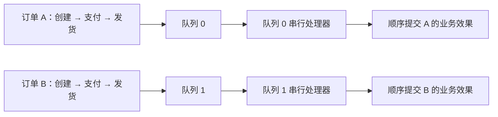

# 顺序消息

顺序是跨生产者路由、队列存储、消费者调度与业务完成的契约。仅把订单 ID 放进消息键，不会建立该契约。

对于同一业务实体，应串行发送到同一队列，并通过目标顺序消费者路径处理该队列。独立队列可以并行推进，彼此不存在全局顺序关系。

## 定义顺序范围



箭头表示逐队列顺序，不要求队列 0 的事件先于队列 1 的事件完成。多个实体可以共享队列，因此一个实体阻塞可能影响该队列上的其他实体。

## 稳定路由相关事件

生产者选择器从当前候选中返回队列。以下片段假设生产者已启动、主题已创建，并存在应用定义的 `order_id: usize`：

```rust
let message = Message::builder()
    .topic("OrderSendTestTopic")
    .key(format!("order-{order_id}"))
    .body("created")
    .build()?;
let result = producer.send_with_selector(
    message,
    |queues, _message, key: &usize| {
        if queues.is_empty() { None }
        else { Some(queues[*key % queues.len()].clone()) }
    },
    order_id,
).await?;
```

发送下一依赖事件前，应检查当前发送结果。选择器控制消息位置，不会串行化两个并发生产者，也不会等待下游业务完成。

取模路由适合解释机制，但候选列表或队列数量改变时，映射也会改变。运维变更需要为在途序列制定交接策略。不能仅因第一个队列暂不可用，就把下一事件改发到其他队列。

## 使用顺序消费接口

使用 `DefaultMQPushConsumer`、`MessageListenerOrderly`、一致的组和订阅，以及所需消费模型。集群模式中，客户端与 Broker 协调队列锁，并串行化本地处理。并发监听器不提供相同顺序边界。

顺序监听器接收 `&mut ConsumeOrderlyContext`，返回 `ConsumeOrderlyStatus`。上下文使用自动提交时，只有按序业务效果完成后才能返回 `Success`。`SuspendCurrentQueueAMoment` 推迟当前队列以便重试。修改上下文自动提交行为之前，应理解保留的手动提交和回滚状态处理。

不要启动独立异步业务工作后立即返回成功，否则下一回调可能先提交业务效果。数据库序列或版本检查可以跨进程重启和所有权迁移拒绝重复、识别缺口。

## 处理失败时保留真实顺序边界

| 故障 | 影响 |
| --- | --- |
| 发送响应丢失 | 事件可能已存在；推进业务序列前，用稳定标识协调或重试 |
| 同一键并发发送 | Broker 到达顺序可能不同于业务意图 |
| 队列数量或候选顺序改变 | 简单选择器可能把实体映射到其他队列 |
| 当前处理失败 | 队列暂停和重试可能阻止后续工作 |
| 再平衡或丢失锁 | 所有权变化，外部业务效果仍需幂等和序列检查 |
| 重试或丢弃策略最终越过失败事件 | 应用必须决定如何修复业务序列缺口 |

顺序处理不意味着业务效果恰好一次，也不意味着无限重试。修改重试限制会影响毒消息之后的业务事件能否继续。跨主题流程需要应用协调或状态检查，不同主题之间不存在自动顺序。

## 运行匹配的示例对

现有生产者和顺序消费者均使用 `OrderSendTestTopic`。按照[快速开始](../getting-started/quick-start.md)的资源创建流程，替换名称创建该主题和 `consumer_orderly_group`。两个示例均使用 `127.0.0.1:9876`。

在 `rocketmq-example/` 中编译：

```bash
cargo check --example producer-order-send --example consumer-orderly
```

在一个终端启动消费者，再在第二个终端启动生产者，两个终端均位于该目录：

```bash
cargo run --example consumer-orderly
```

```bash
cargo run --example producer-order-send
```

生产者为四个订单 ID 依次生成 created、paid、packed、shipped 事件。应逐订单比较队列、偏移量与业务序列，不同队列交错属于预期。消费者对新组采用首偏移量策略，并等待信号后关闭。已有组进度或旧数据会改变观察结果。

这些目标演示固定拓扑下的一次运行，不证明故障转移、队列扩容、多生产者并发发送或消费者数据库崩溃时的顺序。这些应作为独立应用场景验证。

源码依据：[生产者示例](https://github.com/mxsm/rocketmq-rust/blob/main/rocketmq-example/examples/producer/order_send.rs)、[消费者示例](https://github.com/mxsm/rocketmq-rust/blob/main/rocketmq-example/examples/consumer/orderly_consumer.rs)、[顺序服务](https://github.com/mxsm/rocketmq-rust/blob/main/rocketmq-client/src/consumer/consumer_impl/consume_message_orderly_service.rs)、[选择器发送 facade](https://github.com/mxsm/rocketmq-rust/blob/main/rocketmq-client/src/producer/default_mq_producer.rs)。
