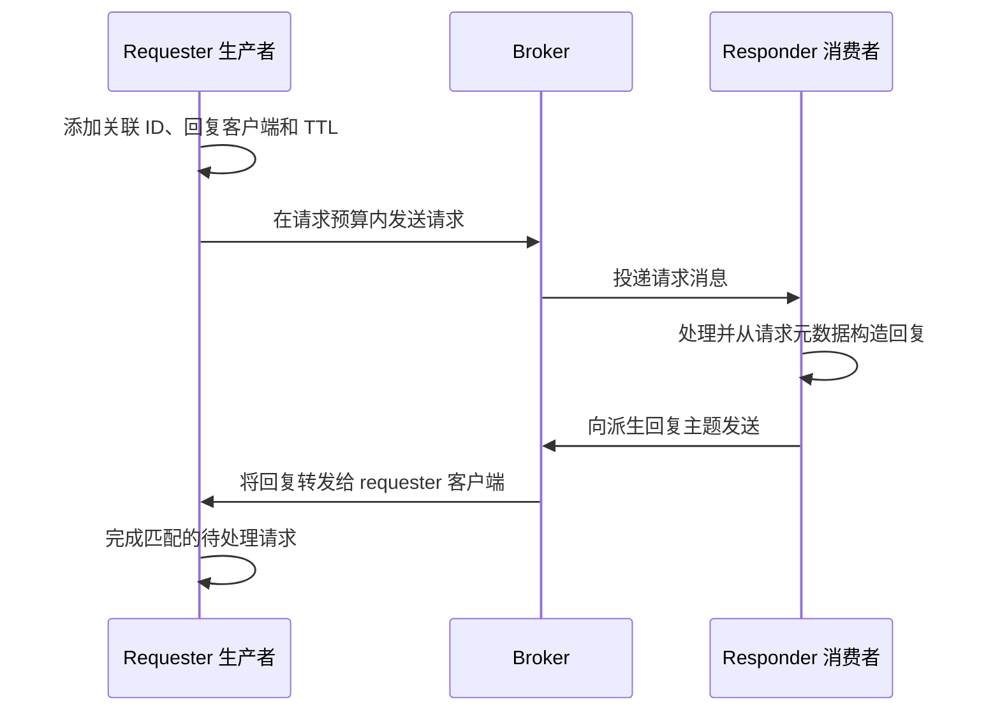

# 请求应答消息

请求应答将 requester 发送的消息与消费者生成的回复关联起来。它依赖 RocketMQ 消息和客户端待处理请求表，不是跨 requester、responder 和业务数据库的原子 RPC 事务。超时表示调用方未在预算内得到预期回复，不表示 responder 未执行任何工作。

## 关联路径



`prepare_send_request` 生成关联 ID，将 requester 客户端 ID 写入回复目标属性，并根据请求超时设置消息 TTL。发送前可能刷新路由和发送心跳。请求路径在等待响应前扣除准备/发送已经消耗的时间，不应将完整超时理解为无限发送之后额外获得的回复等待时间。

`MessageUtil::create_reply_message` 要求请求具有集群属性，并据此派生集群回复主题。它复制存在的回复目标客户端、关联和 TTL 属性，并标记消息为回复。处理时应保留这些属性；仅用同样消息体构造一个无关普通消息，不会形成关联回复。

## 运行仓库中的配对示例

使用[源码搭建](../getting-started/local-source.md)中的本地 NameServer/Broker。示例硬编码 `127.0.0.1:9876` 和下列标识，修改无关环境变量不能替换这些常量。

| 组件 | 仓库值 |
| --- | --- |
| 请求主题 | `RequestSendTestTopic` |
| 请求标签 | `RequestTag` |
| Requester 生产者组 | `producer_request_send_group` |
| Responder 消费者组 | `consumer_request_reply_group` |
| Responder 回复生产者组 | `producer_request_reply_responder_group` |
| 请求和回复发送超时 | 各自调用点均为 3,000 ms |
| Responder 模式 | 集群模式 Push 消费者，批量大小 1，选择器 `*` |

第一条消息集群使用 `DocsCluster`，关闭自动创建主题/消费者组。从仓库根目录使用 Admin CLI 准备请求主题、派生回复主题和 responder 消费者组。下列命令会创建/更新所选本地 Broker 的元数据；若 Broker 集群名不同，应替换对应派生回复主题。

```bash
export NAMESRV_ADDR='127.0.0.1:9876'
cargo run -p rocketmq-admin-cli -- topic updateTopic -n 127.0.0.1:9876 -b 127.0.0.1:10911 -t RequestSendTestTopic -r 4 -w 4
cargo run -p rocketmq-admin-cli -- topic updateTopic -n 127.0.0.1:9876 -b 127.0.0.1:10911 -t DocsCluster_REPLY_TOPIC -r 1 -w 1
cargo run -p rocketmq-admin-cli -- consumer updateSubGroup -b 127.0.0.1:10911 -g consumer_request_reply_group
```

PowerShell 使用 `$env:NAMESRV_ADDR = '127.0.0.1:9876'` 替代 `export`，Cargo 命令行相同。检查所选部署对请求消费和回复发布的授权。不要为重复演示而删除或覆盖已有消费者组进度。

从独立工程仅编译这两个示例：

```bash
cd rocketmq-example
cargo check --example producer-request-send --example consumer-request-reply
```

第一个终端保持在 `rocketmq-example`，启动 responder：

```bash
cargo run --example consumer-request-reply
```

启动后在相同目录打开第二个终端，运行 requester：

```bash
cargo run --example producer-request-send
```

Requester 发送示例消息体，成功时打印 `request response: topic=..., body=reply to ...`。Responder 等待终止信号，requester 完成后停止它。打印消息体是受控示例输出，不是生产负载日志策略。

此流程基于当前配对示例。编译检查与真实请求应答运行分开记录，本次文档变更不宣称示例已在运行中集群完成交换。

## 理解示例的完成语义限制

当前 responder 的同步监听器通过 `tokio::spawn` 执行回复构造/发送，随后立即返回 `ConsumeSuccess`。回复发送失败仅在该分离任务中记录。因此消费成功可能早于失败或未完成的回复，responder 关闭时也没有在监听器中显式等待每个回复任务。

Requester 的部分失败路径同样会在显式生产者关闭前通过 `?` 返回。共享 support 包装器会关闭客户端/进程运行时，但这不等价于证明每个门面都在所有路径完成清理。这些示例用于展示 API 交换，不应将其分离完成模式照搬为生产生命周期设计。

应用应把异步回复工作放入已有的生命周期所有权边界，提供有界准入和完成报告。明确已消费请求的确认与持久业务工作、回复投递之间的顺序。关闭前停止准入并等待所属在途工作，不用嵌套 `block_on` 或无界分离队列绕过同步回调边界。[运行时所有权](../architecture/runtime.md)和 [Push 消费](../consumer/push-consumer.md)说明周边契约。

## 处理故障与重复工作

| 观察 | 含义与应用处理 |
| --- | --- |
| 请求发送失败 | 检查错误及结果是否确定；分发后连接失败仍可能留下已接受工作。 |
| 发送后请求超时 | 回复可能延迟、丢失或仍在处理；只在有业务幂等策略时重试。 |
| 回复构造失败 | 缺少必需集群元数据，或请求未正确保留；不要盲目伪造路由属性。 |
| 回复发送成功 | 发送结果仍有自身状态，不能证明原 requester 仍连接并已接收回复。 |
| Requester 重启 | 内存待处理请求状态和客户端身份不是持久业务结果存储。 |
| 请求再次投递 | 复用业务操作标识，决定返回已存储结果还是安全重复工作。 |
| 迟到或重复回复 | 可能已经没有匹配的活动待处理请求，不将每次回复计作新业务操作。 |

关联 ID 标识一次交换尝试。重新调用 `request` 会生成新关联值，应跨重试保留独立稳定业务键。TTL 是请求元数据和超时预算，不是能够撤销 responder 副作用的取消事务。

长时间业务可采用带持久操作记录的异步结果流程，而不是持续延长短请求应答等待。若外部副作用和回复发布需要协调恢复，应设计 outbox 或等价业务恢复机制；RocketMQ 请求应答自身不提供这种原子性。

来源：[requester 示例](https://github.com/mxsm/rocketmq-rust/blob/main/rocketmq-example/examples/producer/request_send.rs)、[responder 示例](https://github.com/mxsm/rocketmq-rust/blob/main/rocketmq-example/examples/consumer/request_reply_responder.rs)、[请求准备及响应等待](https://github.com/mxsm/rocketmq-rust/blob/main/rocketmq-client/src/producer/producer_impl/default_mq_producer_impl/send.rs)、[回复构造](https://github.com/mxsm/rocketmq-rust/blob/main/rocketmq-client/src/utils/message_util.rs)、[Broker 回复处理器](https://github.com/mxsm/rocketmq-rust/blob/main/rocketmq-broker/src/processor/reply_message_processor.rs)、[示例运行时包装器](https://github.com/mxsm/rocketmq-rust/blob/main/rocketmq-example/examples/support/mod.rs)。
