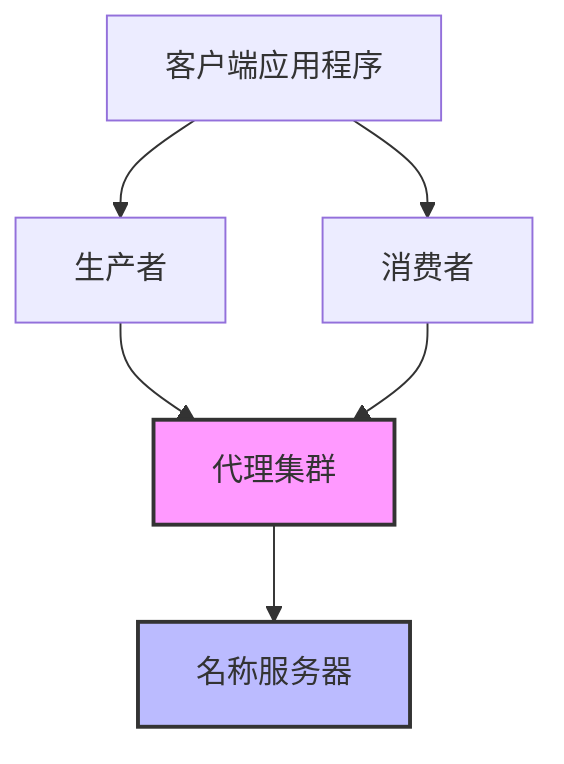

# RocketMQ-Rust 简介

**RocketMQ-Rust** 是一个使用 [Rust](https://www.rust-lang.org/) 构建的高性能分布式消息中间件，重新实现了久经考验的 [Apache RocketMQ](https://rocketmq.apache.org/) 架构。

## 概述

RocketMQ-Rust 将 Apache RocketMQ 的成熟消息模式和可靠性带到 Rust 生态系统中，充分利用 Rust 的内存安全、性能保证和现代异步生态系统。

### 核心特性

- **高性能**：使用 Rust 构建，提供零成本抽象和最小开销
- **内存安全**：利用 Rust 的所有权模型防止整类错误
- **异步/等待**：使用 Tokio 运行时的完全异步架构
- **生产就绪**：专为关键任务企业应用设计
- **类型安全**：强类型在编译时防止错误
- **云原生**：支持容器化和 Kubernetes 部署

## 为什么选择 RocketMQ-Rust？

### 性能

RocketMQ-Rust 提供卓越的吞吐量和低延迟，适用于：

- 大规模流数据处理
- 实时分析管道
- 事件驱动架构
- 微服务通信

### 可靠性

基于 Apache RocketMQ 的成熟架构：

- 可靠的消息传递保证
- 容错和高可用性
- 消息追踪和监控
- 全面的错误处理

### 开发体验

- 清晰、地道的 Rust API
- 优秀的编译时错误消息
- 一流的 IDE 支持
- 全面的文档

## 架构

## 快速链接

- [入门指南](./getting-started/installation)
- [架构概述](./architecture/overview)
- [GitHub 仓库](https://github.com/mxsm/rocketmq-rust)
- [贡献指南](./contributing/overview)

## 许可证

根据 [Apache License 2.0](https://www.apache.org/licenses/LICENSE-2.0) 许可。
