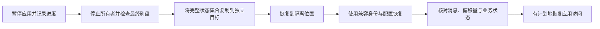

可用备份是一组相互一致的数据、元数据、配置与身份，兼容的部署能够重新打开它们。只复制 CommitLog 目录不构成完整集群备份。本文给出隔离 LocalFile 教程的停机复制流程，并说明其他部署还需保留的状态。

## 盘点恢复集合

| 状态 | 需要包含并识别的内容 |
| --- | --- |
| 消息主数据 | 所有配置的可写/只读 CommitLog 路径、分段布局及相关持久格式元数据 |
| 本地派生状态 | ConsumeQueue、键索引、检查点、恢复游标与后端元数据 |
| Broker 元数据 | 主题、队列映射、订阅组、消费偏移量、顺序/过滤状态，以及配置的 Broker 身份/epoch 路径 |
| 定时、事务、重试、POP | 所选模式的权威记录、检查点、元数据与业务核对要求 |
| RocksDB / 分层状态 | 与主日志一致的数据库、次级文件及元数据；次级路径不会自动成为独立备份 |
| NameServer | 持久化 KV/配置文件；实时路由由 Broker 重新注册 |
| Controller | 各记录身份对应的持久化 Raft 日志、状态、快照与成员关系；Controller 数据不包含消息正文 |
| 部署与安全 | 有效配置、兼容二进制/feature、身份与卷映射、ACL/认证快照、证书与凭据恢复访问 |
| 应用 | 业务幂等/事务状态，以及解释恢复消息所需的客户端本地偏移量 |

以有效路径为准，不依赖默认目录名。Broker 的 `[broker].storePathRootDir` 与 `[store].storePathRootDir` 可以不同，本地教程就使用不同目录。包含外部挂载及所有多路径根目录。备份含有凭据时，应具备与原文件相同的访问限制。



## 复制前建立一致性

停机复制路径先暂停生产并协调消费，记录已确认结果和已提交队列位置，再正常关闭 Broker。检查最终刷盘/关闭结果，确认没有进程继续持有存储。Broker 停止后再停止教程 NameServer。

不要把活跃数据库或持续变化的一组文件复制后标为应用一致。存储平台快照可能提供不同的崩溃一致性约定，多卷、数据库检查点与应用状态仍需明确协调。RocksDB 检查点本身不协调所有外置 CommitLog 和 Broker 元数据路径。

分布式部署应决定备份整个已停止部署，还是使用明确支持的在线检查点/恢复集成。不要在不同时刻独立复制任意副本目录，就假定它们代表一致的 Controller/Broker 权限状态。本文不提供通用的在线集群快照命令。

## 复制已停止的本地教程

以下 PowerShell 示例仅适用于[第一条消息教程](../getting-started/local-source.md)：一个 NameServer、一个 LocalFile Broker，状态通过相对路径保存在 `.rocketmq-doc-demo`，没有 Controller 或外置存储根目录。**停止相关进程与应用后**，从仓库根目录执行，选择尚不存在的目标名称：

```powershell
$ErrorActionPreference = "Stop"
$docsBackup = Join-Path $env:USERPROFILE "rocketmq-backups/first-message-copy"
if (Test-Path -LiteralPath $docsBackup) { throw "Choose a new backup destination." }
if (-not (Test-Path -LiteralPath ".rocketmq-doc-demo")) { throw "Tutorial state is missing." }
New-Item -ItemType Directory -Path $docsBackup | Out-Null
New-Item -ItemType Directory -Path (Join-Path $docsBackup "configuration") | Out-Null
Copy-Item -LiteralPath ".rocketmq-doc-demo" -Destination $docsBackup -Recurse
Copy-Item -LiteralPath "rocketmq-website/examples/first-message/namesrv.toml" -Destination (Join-Path $docsBackup "configuration/namesrv.toml")
Copy-Item -LiteralPath "rocketmq-website/examples/first-message/broker.toml" -Destination (Join-Path $docsBackup "configuration/broker.toml")
Get-ChildItem -LiteralPath $docsBackup
```

该操作创建独立副本，保留原状态。在备份旁记录实际二进制版本/feature、备份时间、成功关闭观察、主题/组/队列位置，以及尚未完成的业务工作。实际运行配置与仓库教程不同时，保存实际配置，并包含由此产生的全部状态路径。

同一物理磁盘上的副本不能抵御该磁盘损坏。根据目标故障场景，将完成的备份转移到独立受保护存储。通过恢复演练检查存储可用性与访问能力，不能仅凭复制命令成功判断。

## 恢复到新位置

保持原备份不变。以下示例再创建一个新目录；原教程进程必须保持停止，因为复制的配置仍使用相同回环端口与身份：

```powershell
$ErrorActionPreference = "Stop"
$docsBackup = Join-Path $env:USERPROFILE "rocketmq-backups/first-message-copy"
$docsRestore = Join-Path $env:USERPROFILE "rocketmq-recovery/first-message-trial"
if (Test-Path -LiteralPath $docsRestore) { throw "Choose a new restore destination." }
New-Item -ItemType Directory -Path $docsRestore | Out-Null
Copy-Item -LiteralPath (Join-Path $docsBackup ".rocketmq-doc-demo") -Destination $docsRestore -Recurse
Copy-Item -LiteralPath (Join-Path $docsBackup "configuration") -Destination $docsRestore -Recurse
```

使用兼容备份格式的 NameServer、Broker 二进制。在各服务终端将工作目录切换到 `$docsRestore`，将 `ROCKETMQ_HOME` 设置为该目录，设置 `ROCKETMQ_SECURITY_PROFILE=development-insecure-loopback`，再用二进制绝对路径启动，分别传入 `-c configuration/namesrv.toml`、`-c configuration/broker.toml`。先启动 NameServer，再启动 Broker。

工作目录很关键：复制配置仍保留相对的 `.rocketmq-doc-demo` 路径。不要从仓库根目录启动恢复实例，避免误开原数据。也不要仅为启动另一个进程就修改持久身份。

启动消费者前，通过[管理操作](admin.md)查询恢复后的路由、队列边界和组进度，与备份时记录比较。已有提交位置可能意味着原来的五条教程消息不会再次投递，不要重置生产偏移量来制造恢复成功的现象。

核对保留消息与业务完成，再通过一个隔离的新测试操作确认新消息收发与关闭。区分备份前已确认的消息、不确定发送和备份点之后的写入，它们的处理方式决定实际恢复结果。

## 离线检查复制的 CommitLog

构建 `rocketmq-store-inspect`，其二进制名称为 `rocketmq-cli-rust`：

```bash
cargo build -p rocketmq-store-inspect --bin rocketmq-cli-rust
cargo run -p rocketmq-store-inspect --bin rocketmq-cli-rust -- read-message-log -c /recovery/store/commitlog/00000000000000000000 -f 0 -t 2
```

将路径替换为实际保留分段。读取器输出消息 ID，不输出正文。`-f`、`-t` 按记录计数，不按字节；起点 0、1 均包含第一条记录，2 从第二条开始。它不获取 Broker 的独占 Store 锁，因此使用稳定副本或已停止存储。

无效或截断的帧长度可能终止扫描，而不产生完整损坏报告。读到两个 ID 只能证明检查了这些记录，不能证明整个恢复集合完整。

## 扩展到 HA 与其他后端

按所选 HA 模式和当前权限恢复失效副本，保留其身份，并在重新投入服务前观察追平。不要把复制的旧主节点与幸存集群并行启动为独立可写节点。

完整 Controller 恢复必须保留一致的持久成员关系和节点到存储的映射。过期 Controller 快照加上无关 Broker 数据不能构成安全的新集群。使用准确版本与拓扑支持的恢复路径；本文不提供清空 Raft 状态或随意分配新成员 ID 的通用步骤。

只有后端恢复约定支持且必要主数据仍存在时，才能重建派生索引。修改 `storeType` 不会迁移数据。恢复部署与业务核对完成前，保留原文件。

本文未声明已完成恢复、磁盘损坏或分布式 RPO/RTO 演练。应在实际场景测量已确认消息恢复量、重复/核对工作、不可用区间与恢复耗时，再报告恢复目标已达成。

## 源码索引

[Broker 元数据路径](https://github.com/mxsm/rocketmq-rust/blob/main/rocketmq-broker/src/broker_path_config_helper.rs)、[存储配置](https://github.com/mxsm/rocketmq-rust/blob/main/rocketmq-store/src/config/message_store_config.rs)、[离线工具](https://github.com/mxsm/rocketmq-rust/blob/main/rocketmq-tools/rocketmq-store-inspect/README.md)、[存储恢复边界](../architecture/storage-backends.md)、[Controller 权限](../architecture/ha-controller.md)。
