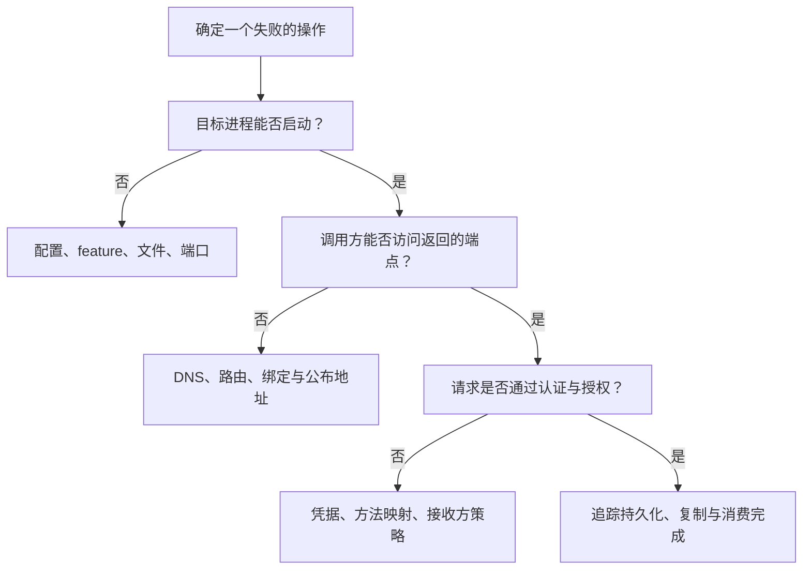

从失败的具体操作、端点、时间、客户端模式与结果开始。对照客户端、路由、Broker 和存储中的同一主题、组、队列。[首次诊断](first-diagnosis.md)提供简短路径，[管理操作](admin.md)提供准确命令。

## 保留有用的观察结果

记录服务版本/构建 feature、与症状有关的非秘密配置、稳定错误码、命令退出状态，以及是否在结果未知时发生超时。收集公开诊断字段，不导出完整请求或配置。故障报告不包含凭据、ACL/TLS 材料或消息正文。



## 启动或构建失败

| 观察结果 | 检查对象 | 下一步 |
| --- | --- | --- |
| Cargo 编译/链接失败 | 仓库工具链、目标包/feature、原生编译器、LLVM、protobuf 依赖 | 按[安装指南](../getting-started/installation.md)处理，保留失败包与诊断信息 |
| 缺少 `protoc` | Proxy protobuf 生成，以及 `PATH` / `PROTOC` | 提供编译器与标准导入；选择另一后端不会移除共享协议构建 |
| Exporter feature-disabled 错误 | 运行期 exporter 与已编译服务 feature | 构建对应 exporter，或明确关闭该信号；见[监控](monitoring.md) |
| TOML 解析或配置无效 | section 作用域、camelCase 字段、路径、所选模式、非秘密配置输出 | 对照当前服务 schema，不把 Java properties 原样复制成 TOML |
| 地址已占用 | 实际占用端口的进程，包括 Broker fast/HA 与健康端口 | 只停止目标旧实例，或分配不重叠的拓扑端口 |
| 存储锁或权限失败 | 其他活跃所有者、数据根目录、卷挂载/身份、文件系统权限 | 恢复独占所有权与预期权限；删除锁文件不能解决活跃所有者冲突 |

清理重编译或更新依赖不是配置、运行故障的通用修复。不要因为旧 FAQ 给出另一最低版本，就修改仓库工具链。

## 连接被拒绝或没有路由

区分三个步骤：访问 NameServer、获取主题路由、访问路由返回的 Broker 地址。TCP 探测成功只覆盖指定地址与端口，不能说明协议认证成功。

Windows 本地教程可执行：

```powershell
Test-NetConnection 127.0.0.1 -Port 9876
Test-NetConnection 127.0.0.1 -Port 10911
```

随后按[管理操作](admin.md)执行 `cluster clusterList`、`topic topicRoute`。主题缺失时，检查是否已明确创建，以及自动创建是否关闭。仅在目标集群中，按预期队列与权限配置创建缺失资源。

路由存在但端点不可达时，检查绑定地址与公布地址、容器/Pod DNS、防火墙及调用方所在网络。只转发 NameServer 不能使内部 Broker DNS 变得可达。有多个 NameServer 时分别查询，并检查 Broker 注册，不把各自结果视为一个原子视图。

## 发送失败或结果不确定

| 结果 | 调查方向 |
| --- | --- |
| 消息无效或功能不支持 | 检查正文、大小、属性，以及所选[发送 API](../producer/sending-messages.md)、事务或定时路径 |
| 认证/授权失败 | 区分身份/签名错误，以及身份有效但没有所需资源/操作权限 |
| 存储不可用或拒绝写入 | 检查磁盘压力、生命周期状态、当前写权限与所需同步副本 |
| 刷盘/复制超时 | 检查本地持久性与 HA 进度；记录可能已经追加 |
| 客户端超时或响应丢失 | 将远端接纳结果视为不确定，关联业务操作并使用安全重试/幂等 |

增加超时只改变等待行为，不增加存储容量或写权限。切换异步刷盘会改变持久性约定，不是无语义影响的延迟修复。HA 场景应检查[权限与复制](../architecture/ha-controller.md)，不能仅凭历史 Broker ID 或端口连通推断当前可写主节点。

## 消费者已连接但收不到消息

1. 确认完整主题名、组名、命名空间和订阅表达式。SQL 过滤需要受支持的 Broker 配置，见[消息过滤](../consumer/message-filtering.md)。
2. 检查当前队列分配及是否由其他消费者持有。消费者多于可分配队列不会自动增加并行度。
3. 比较提交位置与队列最小/最大保留偏移量。新订阅起始策略和已有组保存的位置是不同输入。
4. 检查监听器失败、重试、延迟投递、事务可见性与下游处理。路由正常不会让待决事务自动可见。
5. 按实际模式检查完成路径：Push 的监听器结果与重试、LitePull 的远端偏移量持久化，或 POP 的 ACK/不可见期。

不要只为测试连通性就重置偏移量，重置可能重放业务操作或跳过工作。需要验证第一条消息时，使用新的隔离测试主题与组。

## 重复消息、重试与积压

生产响应丢失、进度持久化失败、POP ACK 失败，或业务完成后消费者重启，都可能造成重复。将持久化的业务幂等键与业务变更一起记录；重启或集合满时清空的内存集合不能保护该边界。

积压增长时，比较一段时间内各队列流入量与消费完成量，区分顺序热点队列、下游 I/O 慢、毒消息反复处理和容量不足。队列偏移量差不是直接的字节数，也不是完整的 POP 在途工作量。见[容量规划](capacity-performance.md)与[投递重试](../guides/delivery-and-retry.md)。

## 存储压力或恢复失败

观察实际配置的根目录、文件系统剩余空间、分段增长、保留/清理活动及磁盘 I/O 延迟。包含外置 CommitLog、元数据和日志路径，不只检查默认 home 目录。

异常恢复时保留原状态和首次失败诊断，使用隔离副本检查。不要把删除 CommitLog、ConsumeQueue、RocksDB 元数据、定时检查点或 Broker 身份作为通用修复。派生数据恢复受后端与版本约束，详见[存储后端](../architecture/storage-backends.md)和[备份恢复](backup-recovery.md)。

内存增长时比较常驻内存、操作系统页缓存、在途消息字节数、保留的响应流、消费者队列和应用集合。仅凭常驻内存不能确定泄漏，应根据实测保留量和下游容量限制生产、处理并发。

## Proxy 与安全故障

| 症状 | 需要区分的内容 |
| --- | --- |
| TLS 握手失败 | 客户端信任根、端点名称、证书有效期/密钥匹配、客户端证书策略、活跃 TLS 代次 |
| gRPC 成功但消息失败 | 传输状态与响应载荷、逐消息状态 |
| 入站认证成功，下游发送失败 | Proxy 出站签名器、挂载内部凭据、Broker ACL、路由可达性 |
| Local 模式资源缺失 | 嵌入式元数据/存储与独立 Broker 集群的区别 |
| 资源耗尽/请求被拒绝 | 接纳控制、有界队列/在途容量、下游慢、响应流保留或排空状态 |
| 凭据轮换似乎无效 | 实际监听/重启行为、内联凭据优先级、新连接与接收方活跃状态 |

按 [Proxy 部署](../deployment/proxy.md)与[部署安全](../deployment/security.md)处理。不要把关闭认证、信任所有客户端证书或添加宽泛 IP 绕过作为默认诊断步骤。

## 监控缺失或关闭不完整

遥测缺失时检查编译 feature、活跃 exporter、继承的 endpoint 变量、Collector 连接与采样，见[监控](monitoring.md)。Rust 服务不会因为使用 RocketMQ 协议就具备 JVM/JMX 工具接口。

关闭超过预算时，检查所拥有的任务、阻塞操作、已接纳请求、响应流和遥测排空报告。取消或超时不能证明运行中的阻塞操作已经停止。在同一数据根目录上重启前，保留这一区别，详见[日常维护](maintenance.md)。

需要进一步协助时，提供最小复现、受影响路径与模式、公开错误码、已脱敏观察结果，以及故障前发生的变化。保留原始数据，为针对性的恢复决策提供依据。
