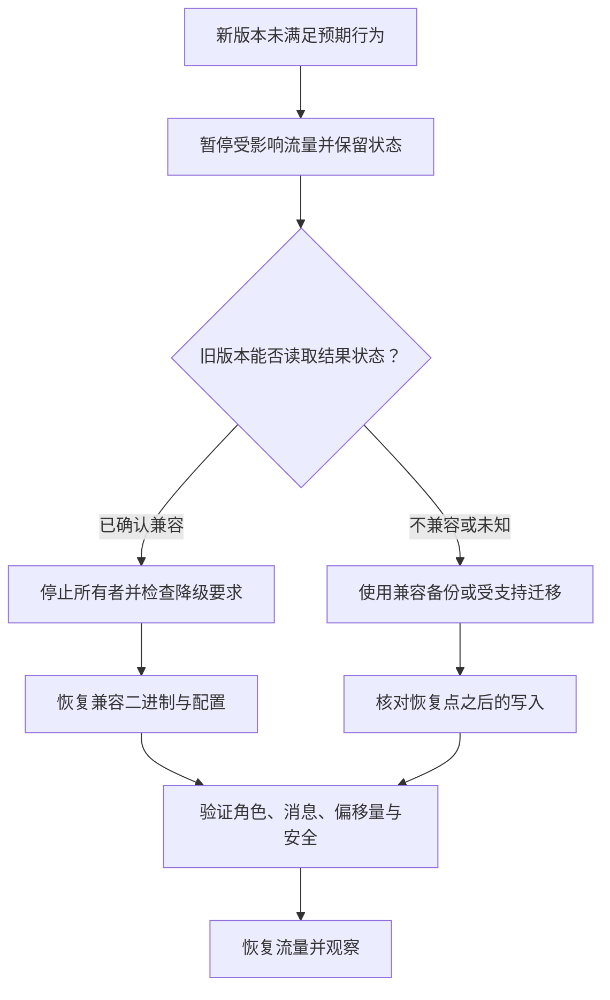

升级改变的不只是可执行文件。选择更新方式前，比较配置、客户端/服务端 API、协议行为、存储格式，以及持久化的 Controller/Broker 身份。Helm 回退或替换旧二进制，不会撤销已经用新格式写入的数据。

## 描述版本迁移

| 接口面 | 比较源版本与目标版本 |
| --- | --- |
| 构建与部署 | 工具链/原生依赖、所选 feature、镜像入口、用户/路径、平台支持 |
| 配置 | 删除/重命名字段、section 结构、默认值、单位、环境优先级、仅启动时生效的值 |
| 客户端与协议 | 公共 API 变化、支持的操作映射、载荷/头字段、重试与完成行为 |
| 存储 | CommitLog 布局/多路径、派生元数据、定时模式、POP 元数据、压缩整理与分层格式 |
| HA 与 Controller | 节点 ID、写权限/epoch、持久成员关系、peer 端点与可用 ACK 容量 |
| 安全与遥测 | 凭据、ACL 语义、TLS 接入、exporter feature 与有效信号选择 |

阅读实际版本对应的发布变化和当前配置、参考文档。不能凭相同 crate 版本或 Apache RocketMQ 协议命名推断兼容性。回退窗口内保留旧二进制、匹配配置与兼容的离线检查工具。

## 准备可恢复状态

按[备份恢复](backup-recovery.md)确定状态集合与一致性时点。记录已确认消息边界和应用进度，从而区分备份点之后的写入。为目标与临时状态预留空间；现有容量无法恢复的备份，不构成可执行恢复方案。

在隔离的兼容副本上验证新版本与代表性业务负载，覆盖启动恢复、收发完成、相关事务/定时/POP 路径、安全和关闭。仅配置解析成功不能证明混合版本滚动集群可用。

更新前明确回退类别：

| 情况 | 回退方式 |
| --- | --- |
| 仅配置变化，旧进程仍能读取全部结果状态 | 恢复兼容配置，通过正常维护重启所选节点 |
| 新二进制写入的状态明确受旧目标版本支持 | 停止所有者、检查兼容性，再按文档执行反向迁移 |
| 新持久格式或不可逆迁移不兼容 | 恢复兼容的先前状态集合，或采用受支持迁移，并核对新增已接纳写入 |
| 兼容性或权限状态未知 | 停止继续更新，先调查，不让旧二进制修改原状态 |

## 按所选可用性约定更新

通过[日常维护](maintenance.md)逐节点排空与追平。版本迁移明确支持混合运行时，每次更新一个实例，并在下一实例前观察实际路由、角色/权限、复制、业务完成和遥测。

客户端、Broker 有可用替代 NameServer 时，可逐个替换 NameServer。默认 HA 副本与主节点的中断影响不同，Controller 模式 Broker 应遵循当前权限。Controller 变更必须保留多数派和持久成员关系；core chart 使用随附 Controller 重启工具。Proxy 可在有额外容量且已验证下游兼容时滚动更新。

任意版本对不存在统一的“永远按某一服务顺序升级”规则。变更不支持混合版本时，应安排协调暂停并执行版本特定迁移，而不是臆造滚动顺序。区分 `OnDelete` StatefulSet 行为、PVC 保留与镜像、配置变化。

## 启动旧 Broker 前检查存储

停止 Broker，确认 Store 已无所有者。使用当前兼容的检查工具，以及包含**实际** `[store]` 路径的 Broker 配置：

```bash
cargo run -p rocketmq-store-inspect --bin rocketmq-cli-rust -- downgrade-preflight --target-version 0.9.0 --config /etc/rocketmq-rust/broker.toml --output downgrade-report.json
```

`0.9.0` 是工具文档接口中的示例目标，不是建议降级到该版本，应选择实际目标。检查配置中使用显式绝对存储路径，避免打开另一个默认或相对目录。

命令获取独占 Store 锁，并报告所检查 Rust 持久格式的兼容性，包括多路径、POP、定时、压缩整理和分层检查。拒绝降级时退出码为 `2`，其他失败使用类型化 CLI 错误码。检查 `allowed`、各项状态与所需动作。检查被拒绝或失败时，不在该状态上启动旧 Broker。

允许报告只覆盖工具实际检查的格式，不代表 Controller 成员兼容、应用 API 兼容、业务状态恢复或整个集群回退已验证。不要修改持久格式标记来让报告通过。

## 仅在迁移需要时合并多路径

离线工具可将受支持的多路径 CommitLog 分段复制到一个新目标：

```bash
cargo run -p rocketmq-store-inspect --bin rocketmq-cli-rust -- consolidate-multipath --source-root /data-a/commitlog --source-root /data-b/commitlog --target /data-consolidated/commitlog --mapped-file-size 1073741824 --store-root /var/lib/rocketmq-rust/store
```

按实际布局替换所有路径和分段大小。Broker 必须停止，Store 根目录和目标父目录必须存在，目标自身不能存在。Store 根目录必须是其锁实际保护 Broker 的目录，而不是无关空目录。

工具检查受支持的分段所有权、连续性、帧结构与空间，复制到暂存目录、比较复制字节、同步文件，再通过重命名发布目标。源文件保留不变。阅读 JSON 报告，只在合并成功后把目标配置更新为新路径，再执行适用的降级检查。合并不会转换全部其他持久格式，也不能修复丢失分段。

## 执行所选回退



恢复较早备份前，记录新版本接纳的写入。恢复旧偏移量或数据可能导致重复处理，或使后续业务工作不可见。应与应用核对，不能把进程启动成功当作完成。

回退后观察当前权限、副本追平、恢复消息区间、消费完成、权限与导出行为。保留失败状态副本及诊断，以便针对性修复。不要让新旧所有者同时打开同一个可写根目录。

本文基于源码给出操作指导，未声明已经完成降级、合并、混合版本切换或全集群回退演练。

## 源码索引

[离线工具接口](https://github.com/mxsm/rocketmq-rust/blob/main/rocketmq-tools/rocketmq-store-inspect/README.md)、[降级检查](https://github.com/mxsm/rocketmq-rust/blob/main/rocketmq-tools/rocketmq-store-inspect/src/downgrade_preflight.rs)、[多路径合并](https://github.com/mxsm/rocketmq-rust/blob/main/rocketmq-tools/rocketmq-store-inspect/src/multipath_consolidate.rs)、[HA 设计](../architecture/ha-controller.md)、[存储后端](../architecture/storage-backends.md)。
