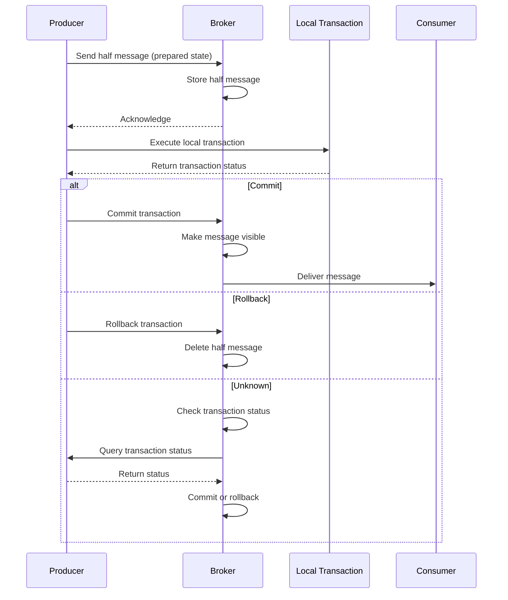

# 事务消息

事务消息用于保证“消息发送”和“本地数据库事务”在分布式场景下的一致性。

## 概览

事务消息可以保证：

1. 消息发送与本地事务具备原子一致语义
2. 只有本地事务提交后，消息才会对消费者可见
3. 系统最终可收敛到一致状态

## 事务流程



## 创建事务生产者

```rust
use rocketmq::producer::TransactionProducer;
use rocketmq::conf::ProducerOption;

#[tokio::main]
async fn main() -> Result<(), Box<dyn std::error::Error>> {
    let mut producer_option = ProducerOption::default();
    producer_option.set_name_server_addr("localhost:9876");
    producer_option.set_group_name("transaction_producer_group");

    let producer = TransactionProducer::new(producer_option)?;
    producer.start().await?;

    Ok(())
}
```

## 实现事务监听器

```rust
use rocketmq::listener::TransactionListener;
use rocketmq::error::TransactionSendResult;

struct OrderTransactionListener {
    db_connection: DatabaseConnection,
}

impl TransactionListener for OrderTransactionListener {
    /// 执行本地事务
    async fn execute_local_transaction(
        &self,
        message: &Message,
        arg: &str,
    ) -> TransactionSendResult {
        // 解析消息，获取订单数据
        let order: Order = serde_json::from_slice(message.get_body())?;

        // 执行本地事务
        match self.db_connection.create_order(&order).await {
            Ok(_) => {
                println!("Order created successfully");
                TransactionSendResult::Commit
            }
            Err(e) => {
                eprintln!("Failed to create order: {:?}", e);
                TransactionSendResult::Rollback
            }
        }
    }

    /// 检查事务状态（本地事务返回 Unknown 时由 broker 回查）
    async fn check_local_transaction(
        &self,
        msg_id: &str,
    ) -> TransactionSendResult {
        // 检查数据库中是否存在对应订单
        match self.db_connection.get_order_by_msg_id(msg_id).await {
            Ok(Some(_)) => TransactionSendResult::Commit,
            Ok(None) => TransactionSendResult::Rollback,
            Err(_) => TransactionSendResult::Unknown,
        }
    }
}
```

## 发送事务消息

```rust
use rocketmq::model::Message;

// 创建事务监听器
let listener = OrderTransactionListener {
    db_connection: db_conn,
};

// 注册监听器
producer.set_transaction_listener(listener);

// 构造消息
let order = Order {
    id: "order_12345".to_string(),
    amount: 99.99,
    customer_id: "customer_67890".to_string(),
};

let body = serde_json::to_vec(&order)?;
let mut message = Message::new("OrderEvents".to_string(), body);
message.set_tags("order_created");
message.set_keys(&order.id);

// 发送事务消息
let result = producer.send_transactional_message(message, &order.id).await?;

println!("Transaction message sent: {:?}", result);
```

## 事务状态

### Commit

本地事务成功，消息应被投递：

```rust
async fn execute_local_transaction(
    &self,
    message: &Message,
    arg: &str,
) -> TransactionSendResult {
    match self.process_order(message).await {
        Ok(_) => TransactionSendResult::Commit,
        Err(_) => TransactionSendResult::Rollback,
    }
}
```

### Rollback

本地事务失败，消息应被丢弃：

```rust
async fn execute_local_transaction(
    &self,
    message: &Message,
    arg: &str,
) -> TransactionSendResult {
    if self.validate_business_rules(message).await {
        TransactionSendResult::Commit
    } else {
        TransactionSendResult::Rollback
    }
}
```

### Unknown

事务状态不明确，Broker 稍后会回查：

```rust
async fn execute_local_transaction(
    &self,
    message: &Message,
    arg: &str,
) -> TransactionSendResult {
    match self.process_order(message).await {
        Ok(_) => TransactionSendResult::Commit,
        Err(_) if is_transient_error() => TransactionSendResult::Unknown,
        Err(_) => TransactionSendResult::Rollback,
    }
}
```

## 事务回查

当状态为 Unknown 时，Broker 会周期性发起回查：

```rust
async fn check_local_transaction(
    &self,
    msg_id: &str,
) -> TransactionSendResult {
    // 查询数据库事务状态
    let tx_status = self.db_connection
        .get_transaction_status(msg_id)
        .await?;

    match tx_status {
        TransactionStatus::Committed => TransactionSendResult::Commit,
        TransactionStatus::RolledBack => TransactionSendResult::Rollback,
        TransactionStatus::Pending => TransactionSendResult::Unknown,
    }
}
```

## 常见模式

### 账户转账

```rust
struct TransferTransactionListener {
    db: DatabaseConnection,
}

impl TransactionListener for TransferTransactionListener {
    async fn execute_local_transaction(
        &self,
        message: &Message,
        arg: &str,
    ) -> TransactionSendResult {
        let transfer: Transfer = serde_json::from_slice(message.get_body())?;

        // 在本地事务中执行转账
        match self.db.transfer_funds(&transfer).await {
            Ok(_) => TransactionSendResult::Commit,
            Err(_) => TransactionSendResult::Rollback,
        }
    }

    async fn check_local_transaction(
        &self,
        msg_id: &str,
    ) -> TransactionSendResult {
        match self.db.get_transfer_status(msg_id).await {
            Some(status) if status == "completed" => TransactionSendResult::Commit,
            Some(status) if status == "failed" => TransactionSendResult::Rollback,
            _ => TransactionSendResult::Unknown,
        }
    }
}
```

### 库存扣减

```rust
struct InventoryTransactionListener {
    db: DatabaseConnection,
}

impl TransactionListener for InventoryTransactionListener {
    async fn execute_local_transaction(
        &self,
        message: &Message,
        arg: &str,
    ) -> TransactionSendResult {
        let order: Order = serde_json::from_slice(message.get_body())?;

        // 校验并预占库存
        match self.db.reserve_inventory(&order.items).await {
            Ok(_) => TransactionSendResult::Commit,
            Err(_) => TransactionSendResult::Rollback,
        }
    }

    async fn check_local_transaction(
        &self,
        msg_id: &str,
    ) -> TransactionSendResult {
        match self.db.get_inventory_reservation(msg_id).await {
            Some(_) => TransactionSendResult::Commit,
            None => TransactionSendResult::Rollback,
        }
    }
}
```

## 配置示例

```rust
let mut producer_option = ProducerOption::default();

// 事务回查超时时间（毫秒）
producer_option.set_transaction_check_timeout(3000);

// 最大回查重试次数
producer_option.set_transaction_check_max_retry(15);

// 回查间隔（毫秒）
producer_option.set_transaction_check_interval(60000);
```

## 最佳实践

1. **保持本地事务简短**：避免长事务导致堆积
2. **实现幂等性**：保证事务可安全重试
3. **完善回查逻辑**：正确处理 Unknown 状态
4. **监控事务状态**：跟踪成功率与失败率
5. **设置合理超时**：平衡一致性与吞吐性能
6. **区分错误类型**：识别瞬时错误与永久错误
7. **记录事务结果**：保留审计日志便于排障

## 局限性

- 事务消息相比普通消息会增加链路延迟
- 回查机制会增加数据库查询压力
- 不适合超高频、超低延迟事务场景
- 回查期间会额外占用 Broker 资源

## 下一步

- [配置](../configuration) - 配置事务相关参数
- [消费者指南](../consumer/overview) - 学习事务消息消费处理
- [常见问题](../faq/troubleshooting) - 排查事务链路问题
