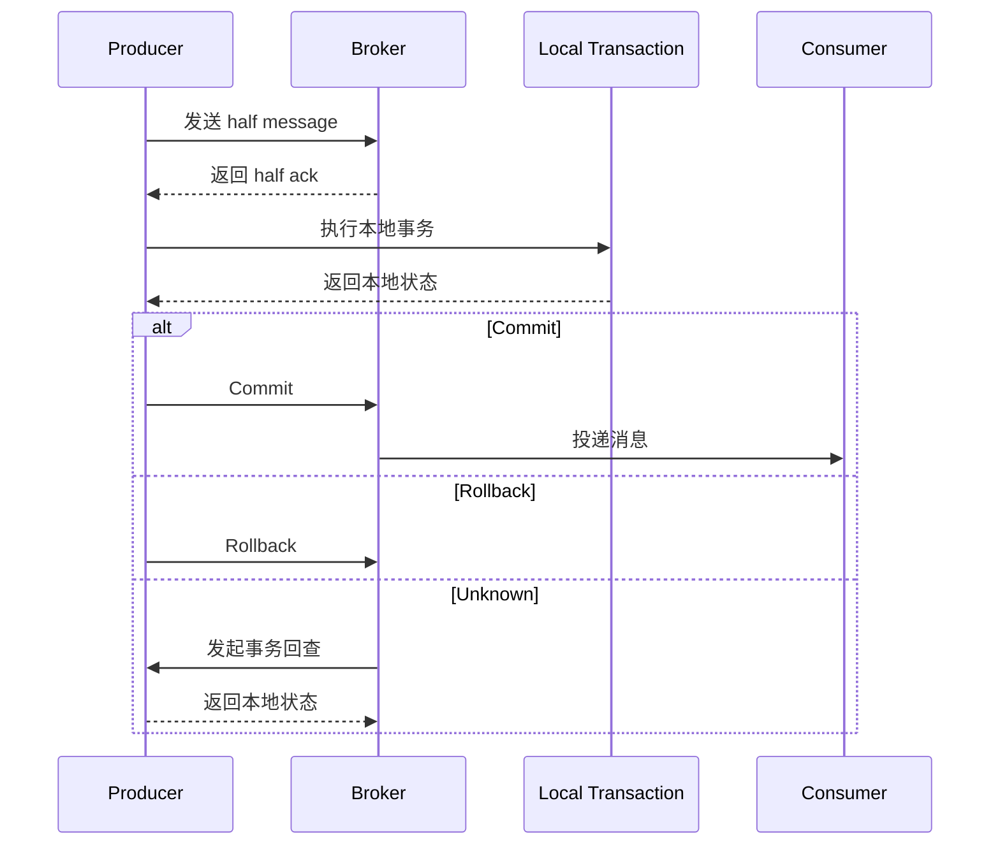

# 事务消息

事务消息用于保证“本地业务状态”与“消息可见性”最终一致。

## 概述

事务消息保证：

1. 先持久化 half message，再执行本地事务。
2. 消息最终可见性由本地事务状态决定（提交或回滚）。
3. 对于未知状态，Broker 可回查生产者。

## 事务流程



## 创建事务生产者

```rust
use rocketmq_client_rust::producer::mq_producer::MQProducer;
use rocketmq_client_rust::producer::transaction_mq_producer::TransactionMQProducer;
use rocketmq_error::RocketMQResult;

#[tokio::main]
async fn main() -> RocketMQResult<()> {
    let mut producer = TransactionMQProducer::builder()
        .producer_group("transaction_producer_group")
        .name_server_addr("localhost:9876")
        .topics(vec!["OrderEvents"])
        .transaction_listener(OrderTransactionListener::default())
        .build();

    producer.start().await?;
    // 发送事务消息...
    producer.shutdown().await;
    Ok(())
}
```

## 实现事务监听器

```rust
use std::any::Any;

use cheetah_string::CheetahString;
use rocketmq_client_rust::producer::local_transaction_state::LocalTransactionState;
use rocketmq_client_rust::producer::transaction_listener::TransactionListener;
use rocketmq_common::common::message::message_ext::MessageExt;
use rocketmq_common::common::message::MessageTrait;

#[derive(Default)]
struct OrderTransactionListener;

impl TransactionListener for OrderTransactionListener {
    fn execute_local_transaction(
        &self,
        msg: &dyn MessageTrait,
        _arg: Option<&(dyn Any + Send + Sync)>,
    ) -> LocalTransactionState {
        // 在这里执行本地事务逻辑
        let _tx_id: Option<&CheetahString> = msg.transaction_id();
        LocalTransactionState::Unknown
    }

    fn check_local_transaction(&self, _msg: &MessageExt) -> LocalTransactionState {
        // 回查本地事务表并返回 CommitMessage / RollbackMessage / Unknown
        LocalTransactionState::Unknown
    }
}
```

## 发送事务消息

```rust
use rocketmq_client_rust::producer::mq_producer::MQProducer;
use rocketmq_common::common::message::message_single::Message;

let message = Message::builder()
    .topic("OrderEvents")
    .tags("order_created")
    .key("order_12345")
    .body("{\"order_id\":\"order_12345\"}")
    .build()?;

let result = producer
    .send_message_in_transaction(message, Some("order_12345".to_string()))
    .await?;

println!("Transaction message sent: {}", result);
```

## 本地事务状态处理（伪代码）

```text
execute_local_transaction(message):
  本地事务成功 -> CommitMessage
  本地事务明确失败 -> RollbackMessage
  本地状态暂不确定 -> Unknown

check_local_transaction(message):
  根据事务 ID 查询本地事务表
  返回 CommitMessage / RollbackMessage / Unknown
```

## 配置

当前 `TransactionMQProducer::builder()` 暴露了事务回查线程池与请求队列相关参数：

```rust
let mut producer = TransactionMQProducer::builder()
    .producer_group("transaction_producer_group")
    .name_server_addr("localhost:9876")
    .topics(vec!["OrderEvents"])
    .transaction_listener(OrderTransactionListener::default())
    .check_thread_pool_min_size(2)
    .check_thread_pool_max_size(8)
    .check_request_hold_max(2_000)
    .build();
```

## 最佳实践

1. 本地事务尽量短、确定性强。
2. 在返回提交/回滚前先持久化本地事务结果。
3. 本地事务逻辑要具备幂等性。
4. `Unknown` 仅用于短暂不确定，不应用于永久失败。
5. 监控回查频率与 Unknown 状态持续时长。

## 限制

- 相比普通消息，事务消息有更高延迟。
- Broker 在提交/回滚前会持有 half message。
- 回查逻辑设计不当会导致长时间 pending。

## 下一步

- [客户端配置](../configuration/client-config) - 查看生产端配置
- [消费者指南](../consumer/overview) - 了解消费端处理
- [故障排查](../faq/troubleshooting) - 排查生产问题
