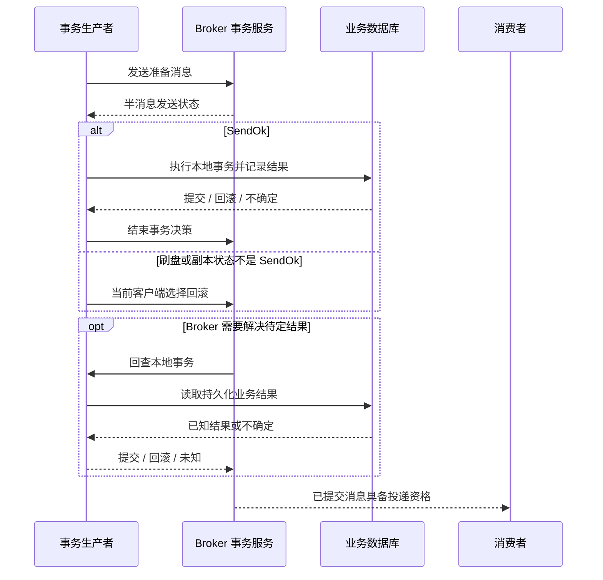

# 事务消息

事务消息用于协调事件可见性与生产者侧业务事务。Broker 先存储准备消息，即半消息，生产者再报告本地提交、回滚或结果未知。它不是横跨 Broker 存储和应用数据库的分布式 ACID 事务。

使用注册了 `TransactionListener`、注入了 `ClientRuntime` 的 `TransactionMQProducer`。普通生产者上的同名方法不能替代事务生产者初始化。先阅读[生产者生命周期](./overview.md)，并创建目标业务主题。

## 准备、决策与回查


```mermaid
sequenceDiagram
    participant P as 事务生产者
    participant B as Broker 事务服务
    participant D as 业务数据库
    participant C as 消费者
    P->>B: 发送准备消息
    B-->>P: 半消息发送状态
    alt SendOk
        P->>D: 执行本地事务并记录结果
        D-->>P: 提交 / 回滚 / 不确定
        P->>B: 结束事务决策
    else 刷盘或副本状态不是 SendOk
        P->>B: 当前客户端选择回滚
    end
    opt Broker 需要解决待定结果
        B->>P: 回查本地事务
        P->>D: 读取持久化业务结果
        D-->>P: 已知结果或不确定
        P-->>B: 提交 / 回滚 / 未知
    end
    B-->>C: 已提交消息具备投递资格
```

最后一条箭头表示具备投递资格，不代表立即回调或业务已处理。半消息响应继承当前存储及复制策略，不能把所有已接纳半消息都描述为已持久复制。

当前客户端仅在 `SendOk` 时执行本地监听器。`FlushDiskTimeout`、`FlushSlaveTimeout` 和 `SlaveNotAvailable` 会选择回滚，不执行该监听器。在获得可用发送结果前发生传输错误，则直接返回错误。部分非成功状态仍可能对应已接纳的日志追加，因此需要区分这些分支。

## 实现可恢复的决策

`TransactionListener` 包含两个同步回调：

| 回调 | 职责 |
| --- | --- |
| `execute_local_transaction(&dyn MessageTrait, Option<&(dyn Any + Send + Sync)>)` | 幂等执行本地业务，返回 `LocalTransactionState` |
| `check_local_transaction(&MessageExt)` | 读取权威持久化结果，返回同一状态域 |

两者均返回 `CommitMessage`、`RollbackMessage` 或 `Unknown`。回调工作应有界。客户端通过受管理的阻塞边界运行本地执行；调用者超时或 panic 映射不会回滚已经提交的外部事务。

以下是应用伪代码，并非完整数据库实现：

```text
execute(message):
    event_id = 消息携带的稳定业务标识
    在同一本地数据库事务中：
        若已有结果记录：返回该结果
        幂等应用业务变更
        持久化 event_id 与最终业务结果
    仅在确认提交后返回 CommitMessage

check(message):
    使用 event_id 读取权威结果
    已提交 -> CommitMessage
    已确定中止 -> RollbackMessage
    不可用或未解决 -> Unknown
```

不要把进程内 map 作为恢复依据。生产者重启，或同组其他合格生产者接到回查时，必须能够通过持久化业务状态回答。回调可选的内存参数不会作为持久事务元数据由 Broker 回传。

状态缺失需要业务策略：它可能表示尚未执行、暂不可见或存储不可用。把所有查询失败都返回为回滚，可能隐藏已提交的业务变更；永久返回未知则会积累未解决工作，并最终受到 Broker 配置的回查或丢弃策略约束。

## 集成生产者

以下片段假设 `client_runtime` 是应用共享运行时，`listener` 是真实的 `TransactionListener` 实现：

```rust
let mut producer = TransactionMQProducer::builder(client_runtime.clone())
    .producer_group("docs_transaction_group")
    .name_server_addr("127.0.0.1:9876")
    .topics(vec!["TransactionSendTestTopic"])
    .transaction_listener(listener)
    .build();
```

发送前启动生产者，并检查返回 `TransactionSendResult` 中的两个字段：

```rust
let message = Message::builder()
    .topic("TransactionSendTestTopic")
    .key("order-1001:event-1")
    .body("order created")
    .build()?;
let outcome = producer
    .send_message_in_transaction::<(), _>(message, None)
    .await?;
```

`send_result` 描述准备消息发送，`local_transaction_state` 描述客户端决策。**两个字段都不是 Broker 最终提交回执。** 当前实现会记录结束事务请求失败，但仍可能返回 `Ok(TransactionSendResult)`。应保持事务回查可用，以弥合这个故障窗口。

在未完成工作已经解决，或交给明确恢复流程后，依次关闭事务生产者、共享 ClientRuntime、RuntimeOwner 和遥测设施。返回未知后立即停机，会使当前进程无法回答后续回查。

## 故障窗口

| 窗口 | 对应用的影响 |
| --- | --- |
| 半消息结果不确定 | 不应假定消息不存在；通过稳定业务标识协调状态 |
| 业务已提交，报告提交前进程退出 | Broker 回查必须恢复持久化的已提交结果 |
| 结束事务请求失败 | 本地返回提交不能证明消费者立即可见 |
| 回查到达不共享状态的生产者 | 该组无法可靠解决待定事务 |
| 业务执行或回查 panic | 当前客户端将回调失败映射为未知；需要排查底层操作 |
| 消费者副作用已提交，但进度未持久化 | 消费者可能再次收到已提交消息 |

事务消息不会消除消费者幂等要求，详见[投递与重试](../guides/delivery-and-retry.md)。

## 限制与组合条件

当前事务路径拒绝延迟或定时属性，包括延迟级别、相对延迟和绝对投递时间。不要组合普通批量 API 与事务发送，并由此推断支持批次事务。

回查设置要求 min/max 均为正值、min 不大于 max、请求保留上限为正值。实现采用准入信号量：max 限制并发回查，hold max 限制已接纳回查工作。min 会被校验，但不能据此认为会创建指定最小数量的专用操作系统线程池。

Broker 回查间隔、最大回查次数、事务服务可用性和生产者连通性都会影响结果解决。它们属于部署条件；只有监听器类型存在，不能证明完整事务路径已经配置。

## 阅读示例时区分接口演示与恢复验证

在 `rocketmq-example/` 中执行：

```bash
cargo check --example producer-transaction-send
cargo run --example producer-transaction-send
```

先在回环集群创建 `TransactionSendTestTopic`。示例在内存中交替返回提交、回滚、未知，发送六条后关闭。它展示监听器接入和结果结构，没有持久化业务事务日志，也不会持续运行以证明所有未知消息最终解决。

验证应用事务集成时，应保持可回查生产者在线，在消费者侧观察仅已提交业务事件可见，并单独演练本地提交后、报告结束事务前的重启窗口。记录该场景的真实结果；编译示例不等于完成这种验证。

源码依据：[事务 facade](https://github.com/mxsm/rocketmq-rust/blob/main/rocketmq-client/src/producer/transaction_mq_producer.rs)、[发送与决策路径](https://github.com/mxsm/rocketmq-rust/blob/main/rocketmq-client/src/producer/producer_impl/default_mq_producer_impl/transaction.rs)、[回查调度](https://github.com/mxsm/rocketmq-rust/blob/main/rocketmq-client/src/producer/producer_impl/default_mq_producer_impl/lifecycle.rs)、[示例](https://github.com/mxsm/rocketmq-rust/blob/main/rocketmq-example/examples/producer/transaction_send.rs)。
